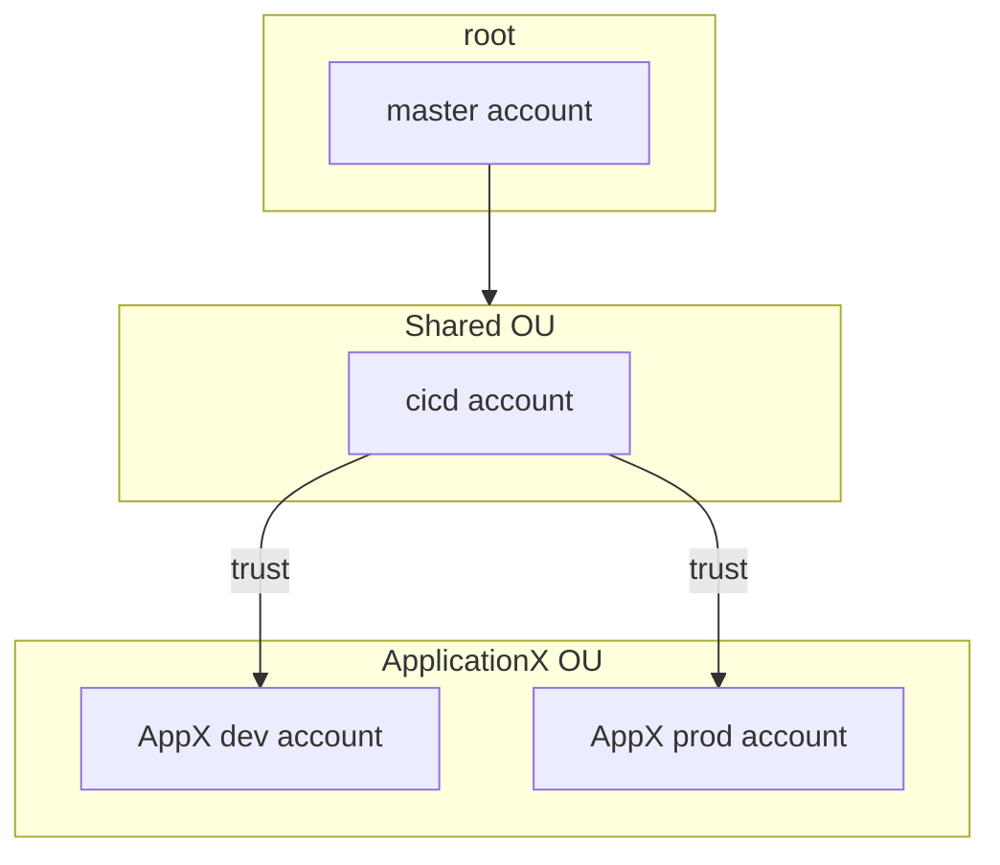
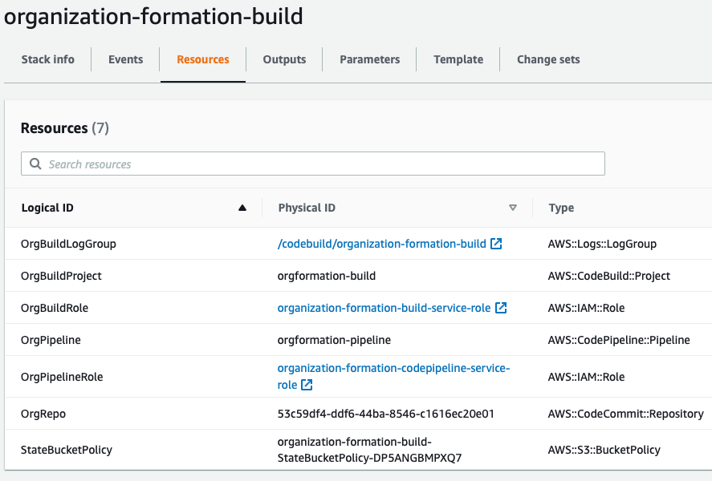
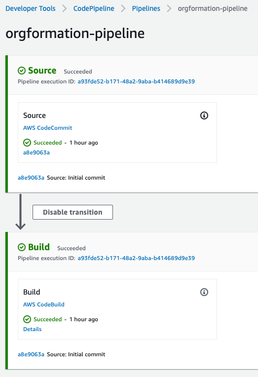
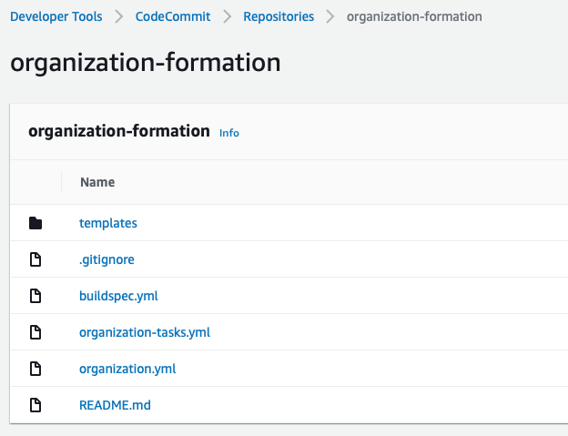
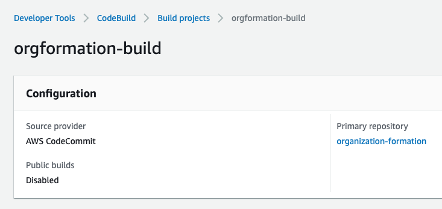

- [About](#about)
- [Install](#install)
- [Prerequisites](#prerequisites)
- [Develop](#develop)
  - [Init state](#init-state)
  - [Org-formation CICD pipeline](#org-formation-cicd-pipeline)
    - [Bootstrap (init) pipeline](#bootstrap-init-pipeline)
    - [Setup Codecommit repo](#setup-codecommit-repo)
  - [Add SCP Policies](#add-scp-policies)
  - [Managing AWS Organization with tasks](#managing-aws-organization-with-tasks)
- [How to run and deploy](#how-to-run-and-deploy)
- [CICD](#cicd)

# About

This project describes step-by-step configuration of AWS Organization with AWS Organization Formation IaC tool.

# Install

With npm installed, get `aws-organization-formation` package:

`npm install -g aws-organization-formation`

This is the tool commonly known under `ofn` abbreviation.

# Prerequisites

1. Credentials with profile for master aws account are configured (named profile is for convenience).
2. Clone this repository, checkout code

# Develop

The repository designed in form of bare-bone main branch with feature branches that incrementally add functionality.

The Readme describes how to build up this functionality by checking out branches and running `org-formation`

AWS Organization diagram for this exercise:



## Init state

Checkout `main` branch where `organization.yml` config will be updated.

The first step for `org-formation` is to initialize config file, run this command: `org-formation init organization.yml --profile master-account --region us-east-1 --verbose`

`ofn` will pick up existing accounts and OUs in the AWS Organization and save them into organization.yml file for review and further changes. It does not make any changes in AWS at this stage.

Next step, update `organizations.yml` to configure AWS Organizations according to the diagram above with own email.

Next step, create change-set: `org-formation create-change-set organization.yml --profile master-account`

Review change set and if everything looks correct, apply changes: `org-formation update organization.yml --profile master-account`

Commit and push changes to the branch `main`.

## Org-formation CICD pipeline

While ofn can work well as a cli, it is more practical to configure automation, so it can apply changes from git repository. Using branch `init-pipeline`, let's bootstrap pipeline and apply changes with git push.

There will be multiple steps, ofn creates multiple resources, the major ones are:

1. Cloudformation stack
2. Codecommit repository
3. CodepiPeline
4. Codebuild

### Bootstrap (init) pipeline

Run `org-formation init-pipeline organization.yml --profile master-account --region your-region --build-account-id {master_account_id} --verbose`

The output should be similar to this:

```bash
org-formation init-pipeline --profile master-account --region us-east-1 --build-account-id 208334959160 --verbose --print-stack
INFO: uploading initial commit to S3 organization-formation-208334959160/initial-commit.zip...
INFO: creating codecommit / codebuild and codepipeline resources using CloudFormation...

DEBG: putting object to S3:
{
  "Bucket": "organization-formation-208334959160",
  "Key": "state.json"
}
INFO:
INFO: Your pipeline and initial commit have been created in AWS.
INFO: Hope this will get you started!
INFO:
INFO: Take your time and browse through the source, there is some additional guidance as comments.
INFO:
INFO: Have fun!
INFO:
INFO: --OC
```

Ok, it completed. So what did just happen?

1. ofn created Cloudformation stack that deployed resources for the pipeline



2. It created simple CodePipeline



3. There is a Codecommit repository, which triggers pipeline



4. Codebuild that runs org-formation cli



The `ofn` pushed some code to Codecommit, lets review it.

### Setup Codecommit repo

`ofn` puts the code in Codecommit repository, so there some complexity of working with it. AWS provides a helper `git-remote-codecommit` for Codecommit to make git cli work transparently. The helper is a Python package, unfortunately it brings the whole Python ecosystem as a dependency (please let me know if there is a better way to do it).

`pip install -r requirements.txt`

Then set a remote tracking main branch from Codecommit: `git remote add origin-cc codecommit::us-east-1://master-account@organization-formation` (`orgin-cc` can be any string, but make it memorable so origins for github and codecommit repositories are easy to distinguish).

Next, pull changes that init-pipeline made with `git pull origin-cc main --allow-unrelated-histories` which may cause some merge conflicts.

At this point, a commit and `git push orgin-cc` will trigger the pipeline to deploy changes.

The main branch at the Codecommit `origin-cc` should have a structure similar to this:

```
tree .
.
├── 000-organization-build
│   ├── org-formation-build.yml
│   └── organization-tasks.yml
├── README.md
├── buildspec.yml
├── organization-parameters.yml
├── organization-tasks.yml
└── organization.yml

1 directory, 7 files
```

It includes templates both for the pipeline and AWS organization - very convenient!

## Add SCP Policies

Now lets add a simple SCP to the root of the org. The SCP will restrict access to specific regions.

Switch to branch `scp` and rebase `main` (`git rebase main`), it will bring all the changes from `main` branch, the one that should be in sync with Codecommit. We will use it in a moment to apply changes with SCP policies.

Add SCP policy in the end of `organization.yml`

```
  RestrictUnusedRegionsSCP:
    Type: OC::ORG::ServiceControlPolicy
    Properties:
      PolicyName: RestrictUnusedRegions
      Description: Restrict Unused regions
      PolicyDocument:
        Version: '2012-10-17'
        Statement:
          - Sid: DenyUnsupportedRegions
            Effect: Deny
            NotAction:
              - 'cloudfront:*'
              - 'iam:*'
              - 'route53:*'
              - 'support:*'
            Resource: '*'
            Condition:
              StringNotEquals:
                'aws:RequestedRegion':
                  - us-east-1
                  - us-east-2
```

Add reference to the policy in the OrganizationRoot key:
```
  OrganizationRoot:
    Type: OC::ORG::OrganizationRoot
    Properties:
      DefaultOrganizationAccessRoleName: OrganizationAccountAccessRole
      ServiceControlPolicies:
        - !Ref RestrictUnusedRegionsSCP
```

Commit changes, compare with main: `git diff main organization.yml`

Now switch back to the main branch (`git checkout main`), and merge `scp` branch (`git merge scp`).
Last step is to push changes to the Codecommit (`git push --set-upstream origin-cc main`).

In a few minutes changes will be deployed!

## Managing AWS Organization with tasks

Through the above steps, `ofn` helped setup up AWS Organization with multiple OUs and account, bootstrap CICD pipeline to apply changes via commits to a repository, and allowed to configure a basic SCP policy.

It is time to setup something useful for the application development. Route53 domain delegation is one of such tasks: it is simple enough and fits in a small Cloudformation template, yet there is enough complexity for cross-account resource exchanges (NS records) to test drive `ofn` in a real-world scenario.

Branch `tasks-cdk-bootstrap` contains configurations for CDK Bootstrap and the [subdomains](https://github.com/org-formation/org-formation-cli/tree/master/examples#subdomains) setup using tasks.

[TODO] task file

# How to run and deploy

Execute tasks:

`org-formation perform-tasks --perform-cleanup ./organization-tasks.yml --state-object state.json --profile master-account`

Print CF stack for review:

`org-formation print-stacks ./templates/subdomains.yml --profile master-account`

# CICD

The project had org-formation bootstrap CICD pipeline:

`org-formation init-pipeline organization.yml --profile master-account --verbose --print-stack`

`org-formation` is using AWS Codecommit to trigger changes.

Add git helper with `pip install git-remote-codecommit`, then clone repository from Codecommit

`git clone codecommit://organization-formation cdk-pipelines-example-org-formation`

Respectively, pushes to main branch will trigger pipeline, `git push origin main`

The pipeline is very simple is essentially runs `org-formation` cli to execute tasks tasks.