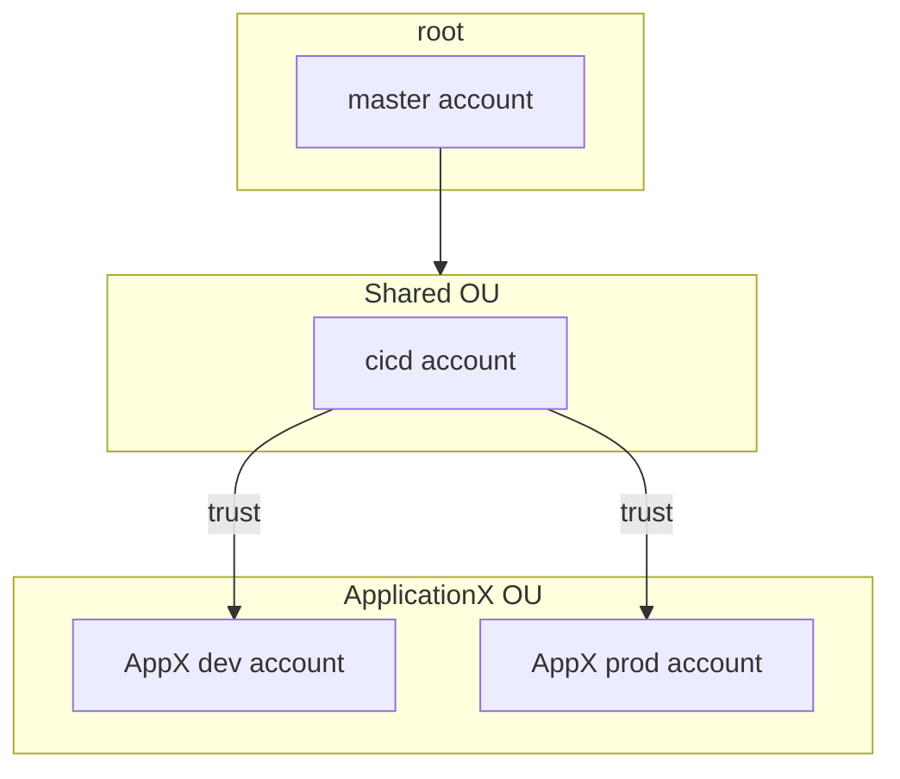

# Build AWS Organization with Code

This project describes step-by-step configuration of AWS Organization with org-formation tool.

# Install

With npm installed, get `aws-organization-formation` package:

`npm install -g aws-organization-formation`

This is the tool commonly known under `ofn` abbreviation.

# Prerequisites

1. Credentials with profile for master aws account are configured (named profile is for convenience).
2. Clone this repository, checkout code

# Develop

The repository designed in form of bare-bone main branch with feature branches that add functionality.

The Readme describes how to build up this functionality by checking out branches and running `org-formation`

AWS Organization diagram for this exercise:

## Init state

Checkout `main` branch where `organization.yml` config will be updated.

The first step for `org-formation` is to initialize config file, run this command: `org-formation init organization.yml --profile master-account --region us-east-1 --verbose`

ofn will pick up existing accounts and OUs in the AWS Organization and save them into organization.yml file for review and further changes. It does not make any changes in AWS at this stage.

Next step, update `organizations.yml` to configure AWS Organizations according to the diagram above with own email.

Next step, create change-set: `org-formation create-change-set organization.yml --profile master-account`

Review change set and if everything looks correct, apply changes: `org-formation update organization.yml --profile master-account`

Commit and push changes to main.

## Init CICD pipeline

`org-formation init-pipeline organization.yml --profile master-account --verbose --print-stack`

# How to run and deploy

Execute tasks:

`org-formation perform-tasks --perform-cleanup ./organization-tasks.yml --state-object state.json --profile master-account`

Print CF stack for review:

`org-formation print-stacks ./templates/subdomains.yml --profile master-account`

# CICD

The project had org-formation bootstrap CICD pipeline:

`org-formation init-pipeline organization.yml --profile master-account --verbose --print-stack`

`org-formation` is using AWS Codecommit to trigger changes.

Add git helper with `pip install git-remote-codecommit`, then clone repository from Codecommit

`git clone codecommit://organization-formation cdk-pipelines-example-org-formation`

Respectively, pushes to main branch will trigger pipeline, `git push origin main`

The pipeline is very simple is essentially runs `org-formation` cli to execute tasks tasks.